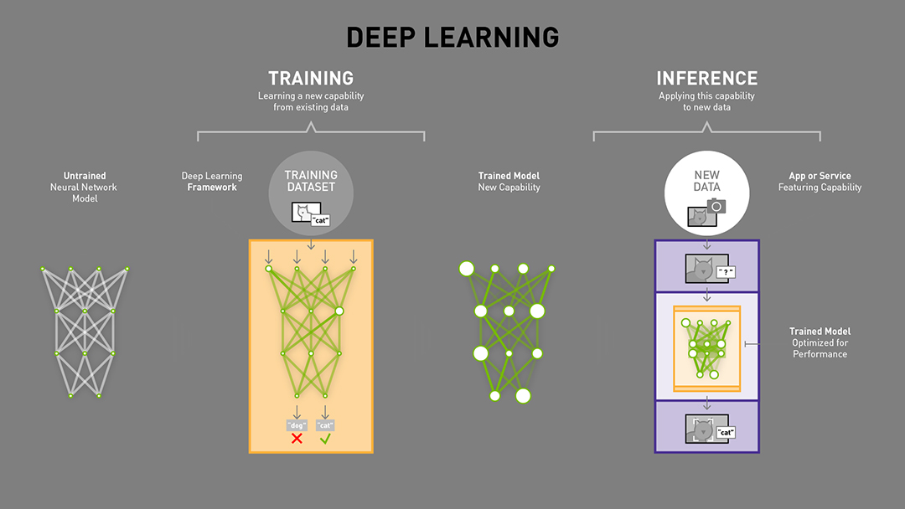

## Kuberlab Cloud Platform
v 1.3
---
## for
---
## Artificial Intelligence 
## Applications
---

## Build  Train  Deploy
---

1. What can you do with Kuberlab?
2. What do you need to start using Kuberlab?
4. A short tour of Kuberlab 
5. How to setup your Kuberlab environment
6. Build your first project

---
### 1.  What you can do with Kuberlab?

- Develop machine learning algorithms
- Create machine learning pipeline
- Use pre-trained models
- Train machine learning models  
- Deploy trained models
---
### 2. What do you need to start using Kuberlab

- GitHub or BitBucket account to use as code repository
- Account on one of the public clouds: Amazon AWS or Google GCP
- or access to the local Kubernetes cluster 
---
### Kuberlab Setup
  - Login to Kuberlab service using your Google or Github account
  
  

---

- Development Workflow
- Production Workflow

---

### Kuberlab Design

- Dispatcher: Manages Data Flow
- Stores: Handle State & Logic
- Views: Render Data via React

---

